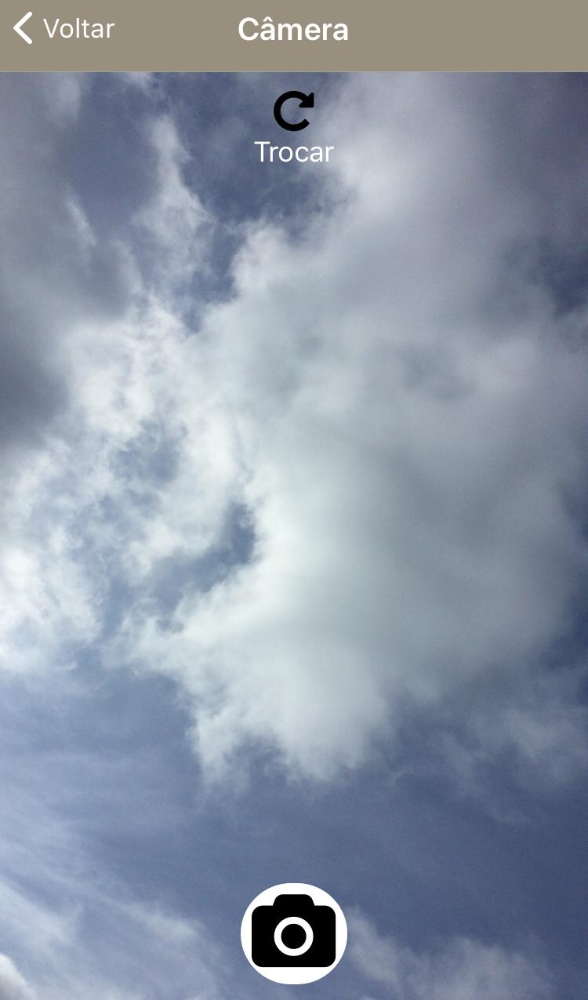
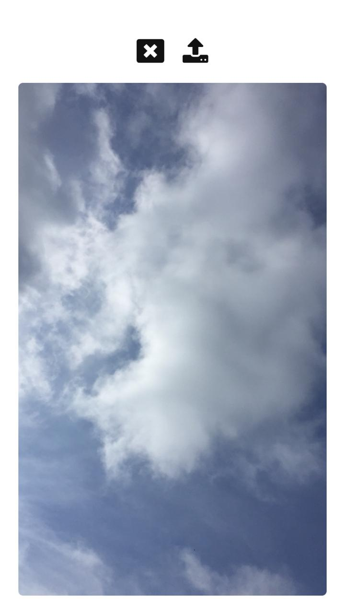

# CAMERA-ALBUM-REACT-NATIVE-APP
Aprimorando o uso de CAMERA, CAMERA_ROLL e PERMISSIONS no REACT-NATIVE.

## Como funciona? - How does it work?

O aplicativo foi criado usando react-native, consiste em uma "galeria de fotos" que possui um sistema para tirar fotos e salvar dentro do álbum criado, as fotos são tiradas através do uso
do **expo-camera** e quando salvas, são armazenadas na CAMERA_ROLL, ou seja, na própria galeria de fotos do celular. Porém, isso só pode acontecer se houver permissão para tais usos.
Por atrás das cenas, houve também, um papel fundamental do react-redux para armazenamento das fotos e álbuns durante o funcionamento da aplicação.

The application was created using react-native, it consists of a "photo gallery" that has a system to take photos and save inside the created album, the photos are taken through the use
**expo-camera** and when saved, they are stored in CAMERA_ROLL, that is, in the cell phone's own photo gallery. However, this can only happen if there is permission for such uses.
Behind the scenes, there was also a fundamental role for react-redux for storing photos and albums during the application's operation.

Fez-se o uso das seguintes bibliotecas: 
The following libraries used:

- react-native
- react-navigation
- expo
- expo-camera
- expo-media-library
- expo-permissions 
- expo-status-bar
- react-redux 
- styled-components

## Capturas de telas - Screenshoots

    
     
     
     
    
   
     
        
        
     

Desenvolvido por, 

Developed by,

lucascicco.

